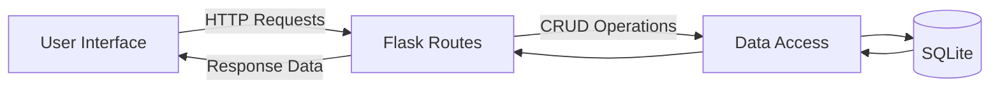

# System Patterns: Brain Dump App

## Architecture Overview
- **Client-Server Model**: Traditional web application architecture
- **Thin Server**: Minimal server-side processing, mostly API endpoints
- **Rich Client**: JavaScript handles most UI interactions

## Key Components
1. **Application Layer (app.py)**
   - Routes HTTP requests
   - Handles business logic
   - Manages data persistence

2. **Data Layer**
   - SQLite database
   - SQLAlchemy ORM
   - Note model with CRUD operations

3. **Presentation Layer**
   - HTML templates (Jinja2)
   - CSS for styling
   - JavaScript for dynamic behavior

## Design Patterns
1. **Model-View-Controller (MVC)**
   - Models: Note, Tag
   - Views: HTML templates
   - Controller: Flask route handlers

2. **Repository Pattern**
   - Abstract data access layer
   - Separation between business logic and data storage

3. **Observer Pattern**
   - UI components react to data changes
   - Real-time updates to note lists

## Data Flow

## Important Implementation Paths
1. **Note Creation**
   - Client POST to /notes
   - Server validates and saves
   - Returns new note data
   - Client updates UI

2. **Note Retrieval**
   - Client GET /notes or /notes/<id>
   - Server queries database
   - Returns JSON or rendered HTML

3. **Tag Management**
   - Many-to-many relationship with notes
   - Special endpoints for tag operations
